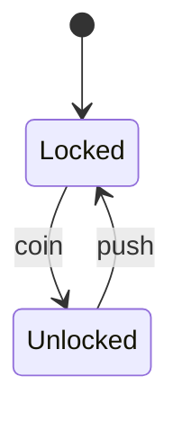

# RFSM

Hierarchical/DAG-aware finite state machine for Go.

- Basic FSM (states, guards, actions, entry/exit hooks)
- Hierarchical states with initial child and event bubbling
- DAG validation and topological order (IsBefore/IsAfter)
- Runtime persistence (snapshot/restore) without redefining
- Visualization: Mermaid and Graphviz DOT

## Install

```bash
go get github.com/ethan/rfsm
```

## Quickstart

```go
import rfsm "github.com/ethan/rfsm"

// Turnstile

def, _ := rfsm.NewDef("turnstile").
	State("Locked").
	State("Unlocked").
	Initial("Locked").
	On("coin", rfsm.WithFrom("Locked"), rfsm.WithTo("Unlocked")).
	On("push", rfsm.WithFrom("Unlocked"), rfsm.WithTo("Locked")).
	Build()

m := rfsm.NewMachine(def, nil, 64)
_ = m.Start()
_ = m.Dispatch(rfsm.Event{Name: "coin"})
_ = m.Dispatch(rfsm.Event{Name: "push"})
_ = m.Stop()
```

## Hierarchical states

```go
sub, _ := rfsm.NewDef("Sub").
	State("A1").
	State("A2").
	Initial("A1").
	Build()

def, _ := rfsm.NewDef("Root").
	State("A", rfsm.WithSubDef(sub)). // A is composite
	State("B").
	Initial("A").
	On("go", rfsm.WithFrom("A1"), rfsm.WithTo("B")).
	Build()
```

Runtime helpers:
- `Current()` leaf; `CurrentPath()` root→leaf
- `IsActive(StateID)`; `HasVisited(StateID)`

## Persistence

```go
bytes, _ := m.SnapshotJSON()
_ = m.Stop()

m2 := rfsm.NewMachine(def, nil, 64)
_ = m2.RestoreSnapshotJSON(bytes, 64) // no hooks invoked during restore
```

## Topology (DAG)

```go
topo, _ := def.ComputeTopology()
_ = topo.IsBefore("Locked", "Unlocked")

ok, err := def.IsAfter("Unlocked", "Locked")
_ = ok; _ = err
```

## Visualization

Mermaid (stateDiagram-v2):

```go
s := def.ToMermaid() // or ToMermaidOpts(rfsm.VisualOptions{ShowGuards:true, ShowActions:true})
```

Graphviz DOT:

```go
dot := def.ToDOT() // or ToDOTOpts(rfsm.VisualOptions{ShowGuards:true, ShowActions:true})
```

Turnstile Mermaid example:



License: MIT
